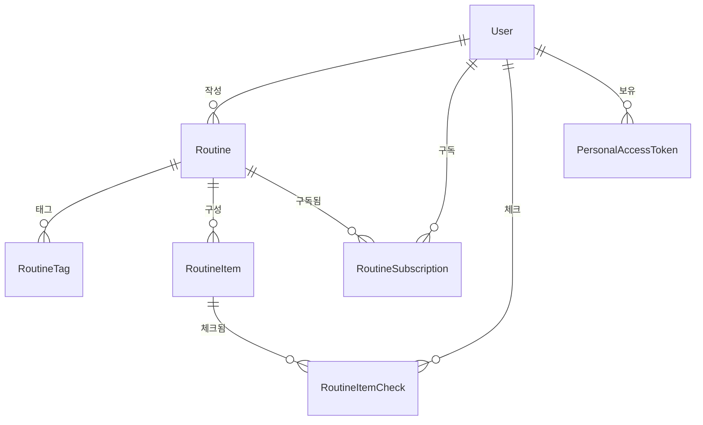

# ERD

> MVP 기준 도메인 설계입니다. 댓글, 좋아요, 팔로우 등 후순위 기능은 포함하지 않습니다.

---

## 전체 관계도

---

## 엔티티 상세

### User

| 필드 | 타입 | 설명 |
|---|---|---|
| id | Long | PK |
| email | String | 로그인 이메일 |
| nickname | String | 표시 이름 |
| password | String | 암호화 저장 |
| createdAt | LocalDateTime | |
| updatedAt | LocalDateTime | |

---

### Routine

| 필드 | 타입 | 설명 |
|---|---|---|
| id | Long | PK |
| authorId | Long | FK → User |
| gameName | String | 게임명 (자유 입력, 자동완성 제공) |
| dailyResetHour | Integer | 일일 초기화 시각 (기본값 0, 0-23) |
| weeklyResetDayOfWeek | Integer | 주간 초기화 요일 (기본값 1=월요일, 1-7) |
| title | String | 루틴 제목 |
| slug | String | 공유 링크용 식별자 (unique) |
| description | String | 루틴 설명 (nullable) |
| visibility | Visibility | PUBLIC / PRIVATE |
| createdAt | LocalDateTime | |
| updatedAt | LocalDateTime | |
| deletedAt | LocalDateTime | 소프트 삭제 |

**Unique 제약**: `slug`

---

### RoutineTag

| 필드 | 타입 | 설명 |
|---|---|---|
| id | Long | PK |
| routineId | Long | FK → Routine |
| name | String | 태그명 (복귀, 뉴비, 이벤트 등) |

**Unique 제약**: `(routineId, name)`

---

### RoutineItem

| 필드 | 타입 | 설명 |
|---|---|---|
| id | Long | PK |
| routineId | Long | FK → Routine |
| title | String | 할 일 제목 |
| description | String | 상세 설명 (nullable) |
| repeatType | RepeatType | NONE / DAILY / WEEKLY / MONTHLY / EVENT |
| targetCount | Integer | 목표 횟수 |
| unit | String | 단위 (회, 개 등) |
| essential | Boolean | 필수 여부 |
| priority | Priority | HIGH / MEDIUM / LOW |
| estimatedMinutes | Integer | 예상 소요 시간 (nullable) |
| conditionText | String | 완료 조건 설명 (nullable) |
| rewardText | String | 보상 설명 (nullable) |
| sortOrder | Integer | 정렬 순서 |
| createdAt | LocalDateTime | |
| updatedAt | LocalDateTime | |
| deletedAt | LocalDateTime | 소프트 삭제 |

---

### RoutineSubscription

| 필드 | 타입 | 설명 |
|---|---|---|
| id | Long | PK |
| userId | Long | FK → User |
| routineId | Long | FK → Routine |
| createdAt | LocalDateTime | |

**Unique 제약**: `(userId, routineId)`

---

### RoutineItemCheck

| 필드 | 타입 | 설명 |
|---|---|---|
| id | Long | PK |
| userId | Long | FK → User |
| routineItemId | Long | FK → RoutineItem |
| periodType | PeriodType | NONE / DAILY / WEEKLY / MONTHLY / EVENT |
| periodStartDate | LocalDate | 기간 시작일 |
| periodEndDate | LocalDate | 기간 종료일 |
| createdAt | LocalDateTime | |

**Unique 제약**: `(userId, routineItemId, periodType, periodStartDate)`

> 레코드 존재 = 체크 완료. 체크 해제는 레코드 삭제로 처리한다. `checked` 컬럼은 두지 않는다.

---

### PersonalAccessToken

| 필드 | 타입 | 설명 |
|---|---|---|
| id | Long | PK |
| userId | Long | FK → User |
| tokenHash | String | 토큰 해시값 |
| name | String | 토큰 이름 |
| scopes | String | 허용 범위 |
| expiresAt | LocalDateTime | 만료일 |
| createdAt | LocalDateTime | |
| revokedAt | LocalDateTime | 폐기일 (nullable) |

---

## 주요 설계 결정

- **루틴 유형 없음**: 루틴은 단일 유형으로 분류하지 않고 태그 기반으로 분류한다. 하나의 루틴이 복귀, 뉴비, 이벤트 등 여러 성격을 동시에 가질 수 있기 때문이다.
- **반복 기준은 RoutineItem**: 하나의 루틴 안에 매일/매주/한 번만 하는 일이 섞일 수 있어, 반복 기준은 루틴 전체가 아니라 개별 아이템이 가진다.
- **체크 상태 분리**: 여러 사용자가 같은 루틴을 구독할 수 있으므로, 체크 상태는 RoutineItem에 직접 저장하지 않고 사용자별 RoutineItemCheck로 분리한다.
- **구독 우선**: MVP에서는 복사보다 구독을 우선 구현한다. 복사는 이후 개인 수정 기능으로 확장한다.
- **Game 엔티티 없음**: 루틴덱은 게임 정보 관리 서비스가 아니다. 게임명은 Routine에 문자열로 저장하고, 루틴 생성 시 기존 게임명을 자동완성으로 제안해 자연스러운 통일을 유도한다.
- **dailyResetHour**: 게임마다 일일 초기화 시각이 다르므로(로스트아크 06:00, 원신 05:00 등) 루틴별로 설정할 수 있다. RoutineItemCheck의 기간 계산 시 이 값을 기준으로 한다.
- **MCP 통합**: MCP 서버는 별도 서비스로 분리하지 않고 같은 Spring Boot 앱에 통합한다. prod에서는 OAuth 2.1, dev/test에서는 PAT로 인증한다.
